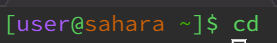
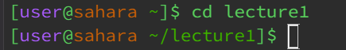
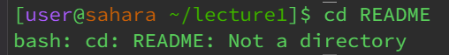
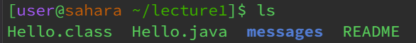
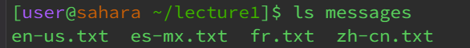
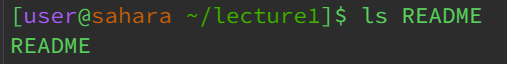

`cd`

Working directory : lecture1

The `cd` command brings the working directory back to home when there is no argument.

This is not an error. 

Working directory: home 

This command moved the working directory into the lecture1 directory which can be seen with lecture1 being written after the "~/". This happens since lecture1 is a directory in home. 

This output is not an error as the `cd` command was used correctly. 

Working directory: lecture1

README is a file in the lecture1 directory and not a directory itself. Therefore cd cannot be used with README as the arguement as it requires a directory.

The output is an error for the same reason as mentioned before - a file was used as an arguement and not a directory. 

`ls`

Working directory : lecture1

The `ls` command lists all the files and folders in lecture 1. It doesn't display the files inside any folders, just the name of the folder. THe folder name is also in another format (blue colour in this instant) which makes it easily identifiable as not being a file. 

This is not an error. 

Working directory: lecture 1  

This command listed the name of all the files in messages.  

This output is not an error.

Working directory: lecture1

Using `ls` command with a file as the path outputs the path of the file name that is used as a relative path.

The output is not an error. 

