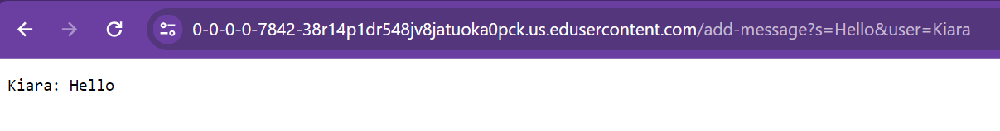
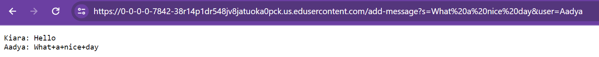
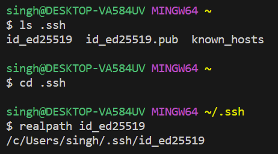
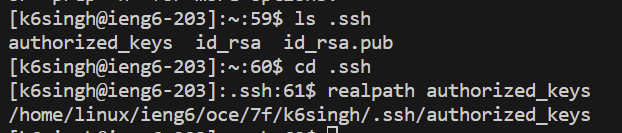
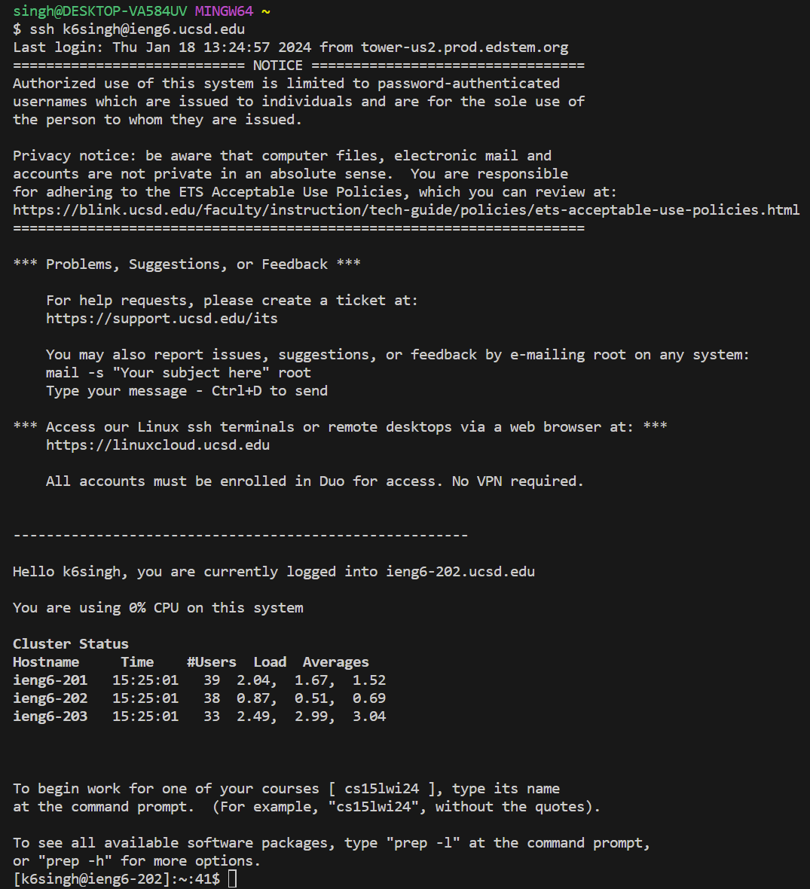

# Part 1 :

## Code for ChatServer 
```
import java.io.IOException;
import java.net.URI;
import java.util.ArrayList; 

class Handler implements URLHandler {
  ArrayList<String> lines = new ArrayList<String>();

  public String handleRequest(URI url){
    String query = url.getQuery();
    if(url.getPath().equals("/add-message")) {
      if(query.startsWith("s=")) { //s=add-message?s=message&user=name
        String[] v1 = query.split("="); //{s,message&user,name}
        String[] v2=v1[1].split("&"); //{message,user}
        if(v2[1].equals("user") && v1[0].equals("s")){
          lines.add(v1[2]+": ");
          lines.add(v2[0]);
          lines.add("\n");
          return String.join("",lines);
        }else{
          return "invalid query";
        }
      }
      else {
        return "/add-message requires a query parameter s\n";
      }
    }
    else {
      return String.join("\n", lines) + "\n"; //prints what is in lines
    }
  }
}

class ChatServer {
    public static void main(String[] args) throws IOException {
        if(args.length == 0){
            System.out.println("Missing port number! Try any number between 1024 to 49151");
            return;
        }

        int port = Integer.parseInt(args[0]);

        Server.start(port, new Handler());
    }
}
```

## Example 1: 

 
For this example, the main method was called and the value of `args[0]` was 7842 which was saved as the `port number`. Then the `Server` method was called with this `port number` and the `Handler` I wrote in `ChatServer.java`. In the `Handler` class I have ArrayList of Strings called `lines` which is a field in the class `Handler` and gets intialised to being empty each time the server method runs. After this: 
- The `handleRequest` function is then ran with `https://0-0-0-0-7842-38r14p1dr548jv8jatuoka0pck.us.edusercontent.com/add-message?s=Hello&user=Kiara` as the value of `URL url`.
- The `String query` variable is set to  `/add-message?s=Hello&user=Kiara`.
- Since the path starts with  `/add-message` and the query starts with `s=` the value of 'v1' is the query split at `=` resulting to `"s","hello&user","Kiara"`.
- The value of `v2` is `v1[1]` split at the `&` which results to `"hello","user"`.
- If the query was correct then `v2[1]` should be "user" and `v1[0]` should be `"s"` so this is checked before the next steps. If this is not true, then a inavlid query message is returned. In this case it is true so we proceed. 
- `Kiara: ` is added to `lines` and then `Hello` is added to `lines` as they are `v1[2]` and `v2[0]` respectively.
- "\n" is also added to `lines` after the user and message which signifies a new line. 
- `String.join` concatenates all the elements in `lines` resulting to the output in the photo above.

## Example 2: 
 
Now, The `handleRequest` function is then ran with `https://0-0-0-0-7842-38r14p1dr548jv8jatuoka0pck.us.edusercontent.com/add-message?s=What%20a%20nice%20day&user=Aadya)` as the value of `URL url`.
- The `String query` variable is set to  `/add-message?s=What%20a%20nice%20day&user=Aadya.
- Since the path starts with `/add-message` and the query starts with `s=` the value of `v1` is now the query split at `=` resulting to `"s","What%20a%20nice%20day&user","Aadya"`.
- The value of `v2` is now `v1[1]` split at the `&` which results to `"What%20a%20nice%20day&user","user"`.
- `v2[1]` is "user" and `v1[0]` is `"s"` so we proceed.
- `Aadya: ` is now added to `lines` and then `What%20a%20nice%20day&user` is added to `lines` as they are `v1[2]` and `v2[0]` respectively.
- "\n" is also added to `lines` after the user and message which signifies a new line. 
- `String.join` concatenates all the elements in `lines` resulting to the output in the photo above. Since there is a "\n" in the ArrayList after each user and message combination, they all get printed in their own line.

In example 2, the value of `url`, `v1`, and `v2` changed but as the ArrayList lines was not intialised again, it still stored the values from example 1. 


# Part 2: 

**Absolute path to the private key for my SSH key for logging into ieng6:**

 

**Absolute path to the public key for my SSH key for logging into ieng6:**

 

**Terminal interaction where I log into my ieng6 account without being asked for a password:**

 

# Part 3: 
Something new I have learned in the past labs and week is how to remotley connect to a server from my own laptop and launch my own server. It was incredibly intresting to me that a server I created could be accessed by my peers and changes to variables in the code would get reflected on both our screens. Additionally, I knew some basics about public and private keys but generating my own to aid in logging in was something I had never done before. In general - a lot of new and usefull skills were gained this week and I look forward to adding to my toolbox. 


