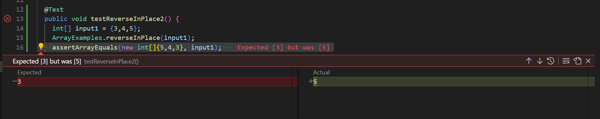
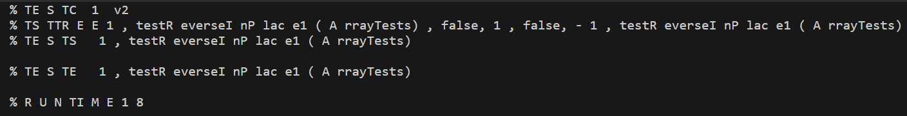

## Part 1

# Bugged Program:
Before:
```

 static int[] reversed(int[] arr) {
    int[] newArray = new int[arr.length];
    for(int i = 0; i < arr.length; i += 1) {
      arr[i] = newArray[arr.length - i - 1];
    }
    return arr;
  }
```

After: 
```
  static void reverseInPlace(int[] arr) {
    for(int i = 0; i < arr.length/2; i += 1) {
      int temp = arr[i];
      arr[i] = arr[arr.length - i - 1];
      arr[arr.length-i-1]=temp;
    }
  }
```
The bug was that by the time we got to the last element, changing it to the first one meant not actually changing it’s value. This is because the first element = last element. By only going up to half the length of the array, this issue is avoided as once we get to the middle, all the elements have already been reversed. When there is a odd number of elements in the lis, the element in the middle index wouldn't change in this code, which works with what the function is trying to do. 

# Faliure Inducing Input:
```
@Test 
public void testReverseInPlace() {
  int[] input1 = {3,4,5};
  ArrayExamples.reverseInPlace(input1);
  assertArrayEquals(new int[]{5,4,3}, input1);
}
```
The output for the above code should have been 5,4,3 but it ws 5,4,5

 


# Succesfull Input:
```
@Test 
public void testReverseInPlace() {
  int[] input1 = {3,3};
  ArrayExamples.reverseInPlace(input1);
  assertArrayEquals(new int[]{3,3}, input1);
}
 ```
  

 Althought the code is wrong, since the list reversed is the same as the orginal list and the first element can equal the last element, this input produces a "succesfull" output. 

# Part 2 

Chosen command: **GREP** 

## Option 1: -i (case insensitive search)
Example 1:
```
	singh@DESKTOP-VA584UV MINGW64 ~/docsearch/technical/government/media (main)
 	$ grep -1 "legal" 5_Legal_Groups.txt 
	
	BY EDWARD MCDONOUGH
	Five independent Salt Lake organizations that provide legal
	services to the poor, ethnic minorities, seniors and people with
	--
	All," which, until this venture, has been a joint fund-raising
	campaign by an alliance of the non-profit providers of free legal
	services. "And Justice for All," which solicits donations primarily
	from Utah lawyers and foundations, was the first joint fund-raising
	campaign of legal services agencies in the country, and the
	Community Legal Center is the first joint office project of public
	--
	Christenson, pointed out that the shared facility will also be
	efficient for those needing legal services. No longer will a woman
	desperate for a protective order, for example, have to run all over
```
This code searches for the word "legal" including "Legal" "LEGAL" and any other spellings as it is not case sensitive in the 5_Legal_Groups.txt file. 

Example 2: 

```
	singh@DESKTOP-VA584UV MINGW64 ~/docsearch/technical (main)
 	$ grep -r -i "doctor"  biomed
	biomed/1471-2156-4-10.txt:        Cynthia Coffman is the post-doctoral associate who
	biomed/1471-230X-1-6.txt:        effects (Figure 1) is striking and indicates that doctors'
	biomed/1471-2334-3-11.txt:        primary care doctors within one week for failure to
	biomed/1471-2334-3-11.txt:        physician and their primary care doctor on admissions. [ 9
	biomed/1471-2334-3-15.txt:        The work is a portion of MA's doctoral thesis. MA
	biomed/1471-2407-3-18.txt:        the chasm between the doctor or health care provider and
	biomed/1471-2407-3-5.txt:        effects and death. Another is that doctors see prognostic
	biomed/1471-2431-3-4.txt:        providers (doctors, lactation counselors, nurses) may
	biomed/1471-2431-3-4.txt:          doctor.
	biomed/1471-2431-3-4.txt:          about the advantages of breastfeeding from a doctor,
	biomed/1471-2431-3-4.txt:          doctor-mediated information, this paper also presents
	biomed/1471-2431-3-4.txt:          (information from anyone, from a medical doctor, from
	biomed/1471-2431-3-4.txt:            doctor or a nurse before the
	biomed/1471-2431-3-4.txt:            doctor before the birth of their
	biomed/1471-2431-3-4.txt:            the maternity ward by either a doctor or a nurse was
	biomed/1471-2431-3-4.txt:            Doctor-mediated breastfeeding information given
	biomed/1471-2431-3-4.txt:          of the doctors did not make specific recommendations on
	biomed/1471-2431-3-4.txt:          mediated by health care personnel (doctor or
	biomed/1471-2431-3-4.txt:          doctor/nurse) influenced the actual duration of exclusive
	biomed/1471-2431-3-5.txt:          doctor, and therefore some of the questionnaires were not
	biomed/1471-2458-2-21.txt:        offices and clinics of doctors with 3 (4.6%) claims.
	biomed/1471-2458-2-25.txt:              take it to the doctor?' "
	biomed/1471-2458-2-25.txt:              better go to the doctor, you know you're suppose to
	biomed/1471-2458-2-25.txt:              go to the doctor but you don't want to go to the
	biomed/1471-2458-2-25.txt:              doctor because the doctor is not private anymore.
	biomed/1471-2458-3-20.txt:        (e.g. staff meetings of ED doctors). Moreover, our results
	biomed/1471-2458-3-9.txt:        that a doctor's recommendation to have breast cancer
	biomed/1472-6793-2-19.txt:        author DER (doctoral candidate) and contributed to the
	biomed/1472-684X-2-2.txt:        suggest different attitudes of doctors and policies of
	biomed/1472-6882-1-12.txt:        case management increases patient-doctor interaction and
	biomed/1472-6882-2-5.txt:        their doctor or pharmacist. The most commonly consulted CAM
	biomed/1472-6920-2-1.txt:          course, Patient-Doctor II [ 4 ] . The course is taught
	biomed/1472-6920-2-1.txt:            patient-doctor interaction techniques (patient
	biomed/1472-6947-1-2.txt:        treatment options with their doctors. A recent study
	biomed/1472-6963-1-8.txt:        who typically received influenza vaccination in a doctor's
	biomed/1472-6963-3-14.txt:            effect when none exists. A doctor who knows that the
	biomed/1478-7954-1-3.txt:        doctors [ 28 ] . An important aspect in the analyzing the

```

This code recursivley searches the biomed direcotry for ny files with the word doctor (not case sensitive). 

## Option 2: -c (count occurences of match)

Example 1:
```
	singh@DESKTOP-VA584UV MINGW64 ~/docsearch/technical (main) 
 	$ grep -r -c "danger" 911report
	911report/chapter-1.txt:3
	911report/chapter-10.txt:2
	911report/chapter-11.txt:23
	911report/chapter-12.txt:17
	911report/chapter-13.1.txt:2
	911report/chapter-13.2.txt:0
	911report/chapter-13.3.txt:0
	911report/chapter-13.4.txt:0
	911report/chapter-13.5.txt:0
	911report/chapter-2.txt:1
	911report/chapter-3.txt:16
	911report/chapter-5.txt:0
	911report/chapter-6.txt:4
	911report/chapter-7.txt:1
	911report/chapter-8.txt:7
	911report/chapter-9.txt:8
	911report/preface.txt:1
```
This code recursivley visits each file in the ``911report`` directory and counts how many times the word "danger" appears in it and displays the answer.  

Example 2: 
```
	singh@DESKTOP-VA584UV MINGW64 ~/docsearch/technical/biomed (main)
	$ grep -c "adult" 1468-6708-3-1.txt
	20
```

This code calculated how many times the word "adult" appeared in the files ``1468-6708-3-1.txt``.

## Option 3: -C (display surrounding lines with context)

Example 1: 
```
	singh@DESKTOP-VA584UV MINGW64 ~/docsearch/technical/biomed (main)
	$ grep -n "lipid" 1468-6708-3-3.txt
	19:        these trials did not assess the effect of lipid-lowering
	23:        lipid-lowering therapy would provide incremental benefit if
	47:        revascularization and change in lipid levels throughout the
	81:        for a number of reasons. Although lipid-lowering therapy
	102:        lipid-lowing therapy after coronary events.
	179:        syndromes regardless of baseline lipid levels. The small
	182:        dissect the relationship between baseline lipid levels and
	194:        studies suggest that lipid-lowering agents exert short-term
	198:        could still make a compelling argument that lipid-lowering
	207:        in-hospital initiation of lipid-lowering therapy appears to
	209:        19 20 21 ] . Finally, although lipid levels may be
	214:        non-pharmacologic lipid-lowering interventions to attain
	220:        lipid-lowering therapy from patients who present with an
	251:        aggressive vs. earlier lipid lowering therapy.
	263:        less aggressive lipid-lowering in
```
This code prints every line and line number in the ``1468-6708-3-3.txt`` file that contains the word "lipid" as well as the sentence it appears in. 

Example 2:
```
	singh@DESKTOP-VA584UV MINGW64 ~/docsearch/technical/plos (main)
	$ grep  -n "cell" journal.pbio.0020043.txt
	6:        I am a clone. That is, I am a colony of cells that developed from a single fertilized
	7:        egg cell. Most animals are clones like me. It is a slight oversimplification to say that
	8:        all of an animal's cells are genetically identical to each other. Some cells have
	9:        mutations. In mammals, some cells (red blood cells) lack a nuclear genome entirely. Some
	10:        cells have viruses—and when it's in a cell, a virus is basically a gene—that other cells
	11:        lack. But a typical animal is a clone in the sense that all its cells arise from that
	12:        single fertilized egg cell.
	15:        animal is not a clone, but a chimera: a conglomeration of two different cell lineages into
	22:        not from a single fertilized egg but from two genetically different cells. One of these
	23:        cells develops into a special organ (the bacteriome, which houses symbiotic bacteria) that
	25:        Obligate chimerism—the presence of two genetically distinct cell lineages in every
	42:        In all sexual animals and plants, production of an egg cell involves meiosis, the
	43:        complex cellular process (involving DNA replication, recombination, and two nuclear
	46:        these four haploid nuclei becomes the egg cell (oocyte). In ordinary animals, the other
	48:        destroyed—and the oocyte is the single maternal cell that (after fusion with a single
	49:        paternal cell, the spermatocyte) develops into the embryo. But in armored scales, the polar
	50:        bodies fuse together into a triploid cell (with three copies of each chromosome), and this
	51:        triploid cell also winds up in the embryo (Figure 2). The triploid cell derived from the
	52:        polar bodies fuses with one cell from the embryo to become a pentaploid cell (with five
	53:        copies of each chromosome). This pentaploid cell then proliferates to form the bacteriome
	54:        of the embryo (Brown 1965). Each cell in the bacteriome thus contains two copies of the
	57:        mother's genome. The apparent function of the bacteriome is to house intracellular
	59:        cells of the embryo's bacteriome. The precise role of the bacteria is not known, but it is
	90:        nonidentical cell lineages, as there is between the tissues of a mother mammal and her
	93:        case of blood cells between sibling marmosets). But the problem of cooperation between
	101:        mother's mother from the chromosomes derived from the mother's father, producing two cells
	122:          distinct but ultimately sterile cell lineage (the bacteriome) provides nutrition to its
	123:          potentially fertile “sibling” cell lineage (the rest of the scale insect)—though, of
	124:          course, polar body-derived cells are “sibling” in a strange special sense. Like ants and
	137:          and Grbic 1997), in which cells derived from polar bodies form a membrane around the
```
This code searches the ``journal.pbio.0020043.txt`` file for the word "cell" and prints the words surrounding it along with their line number. 

## Option 4: -l (lists files with )

Example 1: 

```
	singh@DESKTOP-VA584UV MINGW64 ~/docsearch/technical/government/Alcohol_Problems (main)
	$ grep -l "drinking" *
	DraftRecom-PDF.txt
	Session2-PDF.txt
	Session3-PDF.txt
	Session4-PDF.txt
```
This code returns the files in the Alchol_Probelems directory with the word drinking. This can be helpful if you're in a large databse of source code and are trying to find the code for a specific function.

Example 2: 

```
	singh@DESKTOP-VA584UV MINGW64 ~/docsearch/technical/plos (main)
	$ grep -1 "danger" *
	journal.pbio.0020047.txt-        approximately 1%, and only a tiny proportion of that 1% are writers), and that
	journal.pbio.0020047.txt:        “electrophysiology, because it is dangerous, is rarely performed” (electrophysiology
	journal.pbio.0020047.txt-        tools—e.g., the study of evoked potentials or electroencephalograms—are noninvasive and
	--
	journal.pbio.0020054.txt-        for a change of thinking, away from a current fascination in the region with satellite
	journal.pbio.0020054.txt:        imaging of “hot spots” where fires are likely to be occurring. Fire danger rating
	journal.pbio.0020054.txt-        concentrates on where fires are most likely to begin. “It allows you to add prevention into
	--
	journal.pbio.0020054.txt-        to which you can get biodiversity concerns mainstreamed to other sectors,” he says. Threats
	journal.pbio.0020054.txt:        to habitat retention, not least of which is wildfire, endanger every species. “It's about
	journal.pbio.0020054.txt-        making people realize that biodiversity is the basis upon which all other things will
	--
	journal.pbio.0020112.txt-        was the primary source of the outbreak, apparently did not know that you have to keep raw
	journal.pbio.0020112.txt:        meat and ready-to-eat products separate to avoid cross-contamination with dangerous
	journal.pbio.0020112.txt-        pathogens, such as
	--
	journal.pbio.0020113.txt-        Atlantic cod in Canadian waters suffered a total population collapse and are now on
	journal.pbio.0020113.txt:        Canada's endangered species list (Figure 1). From 2 billion breeding individuals in the
	journal.pbio.0020113.txt-        1960s, Atlantic cod populations have declined by almost 90%, according to Hutchings. While
	--
	journal.pbio.0020116.txt-        done a disservice when science is presented incompletely; myths are then perpetuated.
	journal.pbio.0020116.txt:        This is but one example of the dangers that three of the Council members who are
	journal.pbio.0020116.txt-        scientists (the two of us along with Michael Gazzaniga of Dartmouth College) pointed out,
	--
	journal.pbio.0020147.txt-        haplodiploids?).
	journal.pbio.0020147.txt:        Perhaps aware of the dangers of getting bogged down in detail, the argument then moves
	journal.pbio.0020147.txt-        to proving a case for the universality of niche construction. Invoking the second law of
	--
	journal.pbio.0020430.txt-        the movie as the inhibitor chip in Octavius's brain stem) would be needed to avoid
	journal.pbio.0020430.txt:        dangerous situations when a chronic neuroprosthesis freely interacts with the real world.
	journal.pbio.0020430.txt-        For both science and science fiction, the question is the same. Brain and machine: which
	--
	journal.pbio.0020439.txt-          too remote in space (life at extremes on the earth and in space); too complex (the human
	journal.pbio.0020439.txt:          brain) or too dangerous or unethical (epidemiology of infectious agents). Box 1
	journal.pbio.0020439.txt-          summarizes five biological and five mathematical challenges where interactions between
	--
	journal.pbio.0030056.txt-        you can make your criteria so stringent that you miss reality.”
	journal.pbio.0030056.txt:        Others are alert to this danger. Sticking rigidly to the authenticity criteria can be a
	journal.pbio.0030056.txt-        problem, argues Tom Gilbert of the Department of Ecology and Evolutionary Biology at the
	--
	pmed.0010034.txt-        The great paradox here is that the same reforms that are improving our current care may
	pmed.0010034.txt:        also be endangering our future health. As medicine has become more standardized and
	pmed.0010034.txt-        increasingly regulated, it turns out there is much less room for innovation. The spirited
	pmed.0010034.txt-        pursuit of the unknown—so long a defining quality of medicine—now seems seriously
	pmed.0010034.txt:        endangered. The new world of rapid throughput and endless documentation provides little
	pmed.0010034.txt-        time to reflect upon important clinical problems and consider fresh approaches. If
	--
	pmed.0010042.txt-        as saying, ‘My No. 1 secret is estrogen’ without any need for her, or the magazine, to list
	pmed.0010042.txt:        the dangers of the hormone replacement therapy made by her sponsor [7]. But perhaps most
	pmed.0010042.txt-        troubling is the way celebrities, with their star power, can help to fundamentally shift
	--
	pmed.0010052.txt-        was sold not as a mere diet drug but as a treatment for obesity, which Wyeth, the
	pmed.0010052.txt:        manufacturer, portrayed as a dangerous public health problem [17]. Estrogen replacement
	pmed.0010052.txt-        therapy was initially marketed as a risk-free way for women to extend their youthfulness.
	--
	pmed.0010058.txt-        people with diabetes can, with diligence and perseverance, implement an insulin regimen
	pmed.0010058.txt:        that maintains tight glucose control while avoiding dangerous hypoglycemia. However, there
	pmed.0010058.txt-        are some patients who continue to have tremendous difficulty managing their disease despite
	--
	pmed.0020002.txt-        comparatively more cases occurring in older individuals and in males [12]. The most
	pmed.0020002.txt:        dangerous form of the disease is meningeal infection, which occurs in about 0.15%–0.75% of
	pmed.0020002.txt-        extrapulmonary coccidioidomycosis cases and requires treatment for life [16].
	--
	pmed.0020035.txt-        diversity and flexibility should be encouraged and not stifled. David Ho, in his
	pmed.0020035.txt:        Perspective on the plan (DOI: 10.1371/journal.pmed.0020036), mentions the danger of “group
	pmed.0020035.txt-        think,” and the Enterprise must not fall into that trap.
	--
	pmed.0020071.txt-        practice called “unmodified ECT”—the use of without any form of anaesthesia or muscle
	pmed.0020071.txt:        relaxants—a practice that is both painful and dangerous [5,6].
	pmed.0020071.txt-
	--
	pmed.0020071.txt-        certification of “mental illness,” which MDRI found, in many cases, to be questionable.
	pmed.0020071.txt:        There are no requirements that a patient be dangerous or in need of psychiatric treatment.
	pmed.0020071.txt-        These laws do not require a right to counsel or a periodic review of commitment, as
	--
	pmed.0020208.txt-        Welfare (DPW) after alerting his seniors to prescribing practices across the state that he
	pmed.0020208.txt:        considered to be alarming and dangerous [2]. “I was fired in a demeaning manner,” said
	pmed.0020208.txt-        Kruszewski, who has sued DPW over his firing. “My two offices were emptied and the contents
	--
	pmed.0020232.txt-        precautionary decision making particularly suitable in this arena. The assumption that
	pmed.0020232.txt:        plausible dangers are negligible, even when it is known that such dangers are
	pmed.0020232.txt-        constitutively very difficult to measure, may be more unscientific than the use of
	--
	pmed.0020278.txt-        of a quarter-century of primate research on AIDS to provide any useful insights; the false
	pmed.0020278.txt:        leads and dangerous vaccines produced during polio research (verified by Albert Sabin,
	pmed.0020278.txt-        himself); the failure of primate studies to improve risks for birth defects and premature

```
This code recursivley searches the ``plos`` directory for the word danger. the `*` indicates to search all the files in the current directory. This is helpful if you know the directory of a certain file but are unsure which specific file has it. Having the context around the word also help in knowing if this is the right file as having the world alone can be confusing. 

Source used for all examples: 

[https://www.youtube.com/watch?v=etez41x3w5E ](url) 
